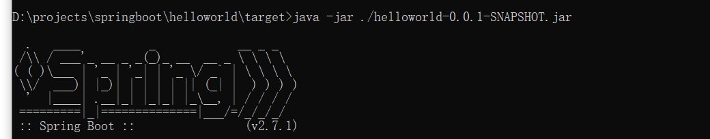

# SpringBoot学习
## web项目打成jar包后直接运行



## 如何自定义端口号等等
修改application.properties即可

## 原理初探
### 自动配置
#### pom.xml
* spring-boot-dependencies：核心依赖在父工程中。
* 我们在引入一些springboot的依赖的时候，不需要指定版本号，就因为有这些版本仓库。

#### 启动器
```xml
<dependency>
    <groupId>org.springframework.boot</groupId>
    <artifactId>spring-boot-starter</artifactId>
</dependency>
```
启动器：说白了就是springboot的启动场景；

比如spring-boot-starter-web，就会帮我们自动导入web环境所有的依赖。

#### @SpringBootApplication
@SpringBootApplication
    // SpringBootApplication类里面有非常重要的两个注解
    @SpringBootConfiguration
        // SpringBootConfiguration类有注解@Configuration，表明这个类是一个配置类
        @Configuration
            // Configuration类中有注解@Component，说明这也是一个spring的组件
            @Component
    // 自动配置
    @EnableAutoConfiguration
        // 自动配置包
        @AutoConfigurationPackage
            // 自动配置包注册
            @Import({Registrar.class})
        // 自动配置导入选择
        @Import({AutoConfigurationImportSelector.class})